# Veteran Benefits Navigator — 화면 가이드 (한국어)

미국 신규 전역자(전역 후 0~24개월) 대상 안드로이드 앱입니다. 이 문서는 각 화면이 **무엇을 보여주고 / 무슨 기능을 제공하며 / 어떤 의미인지**를 한국어로 정리합니다.

> 데이터는 모두 **draft(초안)**입니다. 실제 신청·할인 적용 전에는 반드시 VA.gov 또는 매장에서 다시 확인하세요. 앱 내부 모든 추정 화면에 동일 문구가 표시됩니다.

---

## 1. 온보딩 — Welcome (1/4)

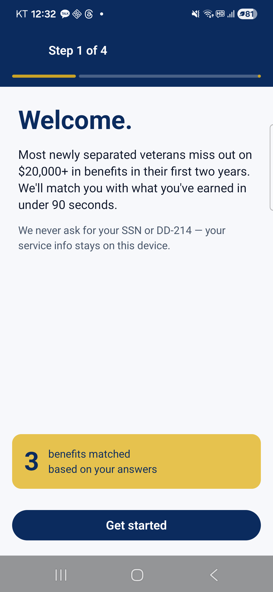

**무엇을 보여주는가**
- 앱 첫 진입 시 표시되는 환영 화면.
- 핵심 메시지: *"Find the benefits you earned"* — 사용자가 복무를 통해 얻은 혜택을 찾아주겠다는 가치 제안.
- 하단 4가지 약속:
  - **Personalized list** — 본인 프로필에 맞는 혜택만 선별
  - **Step-by-step claims** — 신청 단계 가이드
  - **Discount map** — 군인 우대 매장 지도
  - **Privacy first** — 입력 데이터는 기기에만 저장, 서버 전송 없음

**기능**
- `Get started` 버튼 → Service info 단계(2/4)로 이동
- 우상단 `Skip` → Home 직행 (이후 Settings에서 다시 입력 가능)

---

## 2. 온보딩 — Service info (2/4) 빈 상태

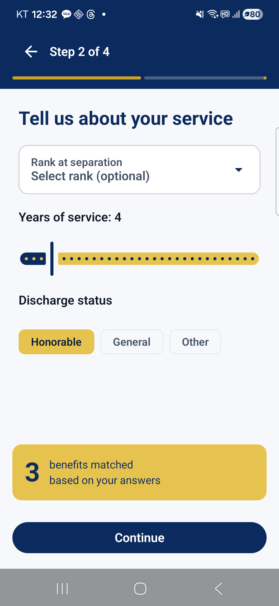

**무엇을 보여주는가**
- 복무 기본 정보 입력 단계. 이 정보로 GI Bill·Home Loan 자격을 판정합니다.
- 입력 필드 4개:
  - **Rank (계급)** — 드롭다운, 탭하면 바텀시트가 열림
  - **Years of service (복무 연수)** — 정수 입력
  - **Service end date (전역일)** — `YYYY-MM-DD`. 이 날짜가 2013-01-01 이후면 *Forever GI Bill*이 적용되어 만료일이 사라집니다.
  - **Discharge status (전역 사유)** — Honorable / General / Other than Honorable / Bad Conduct / Dishonorable. Honorable·General만 대부분 혜택 자격 인정.

**기능**
- 모든 필드를 채우면 화면 하단 `Continue`가 활성화.
- 필드는 초기 빈 상태이며, 좌측 진행 인디케이터가 2/4 위치를 표시.

---

## 3. 온보딩 — Rank 선택 바텀시트

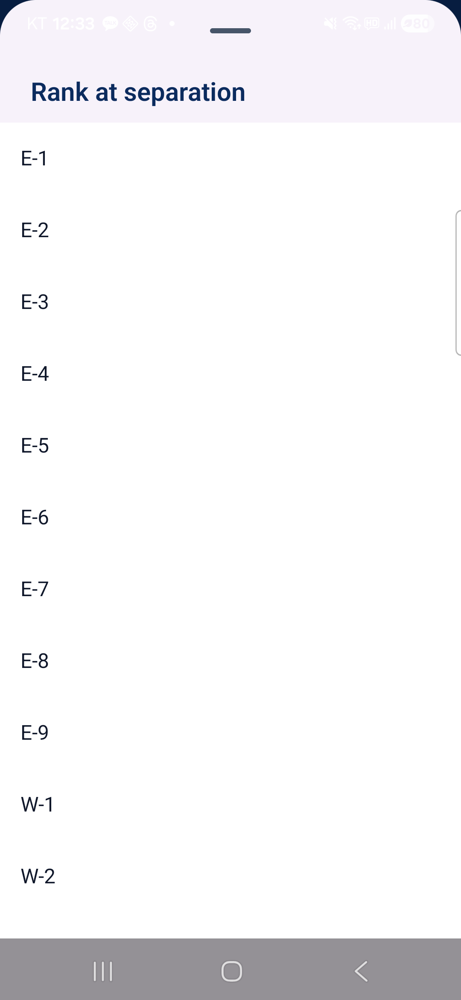

**무엇을 보여주는가**
- Rank 필드를 탭하면 화면 아래에서 올라오는 모달 시트.
- 미군 사병/부사관/장교 계급 카탈로그(E-1 ~ E-9, W-1 ~ W-5, O-1 ~ O-10).
- 각 행은 약자(E-5)와 정식 명칭("Sergeant" 등)을 함께 표시.

**기능 / 의미**
- 항목 탭 → Service info 화면의 Rank 필드에 즉시 반영, 시트 닫힘.
- 시트 외부를 누르거나 아래로 스와이프하면 취소.
- 계급은 혜택 자격 자체에는 영향이 적지만, 계산기·매장 안내에서 *"군인 신분"* 표기에 사용됩니다.

---

## 4. 온보딩 — Service info 작성 후 (E-5 선택)

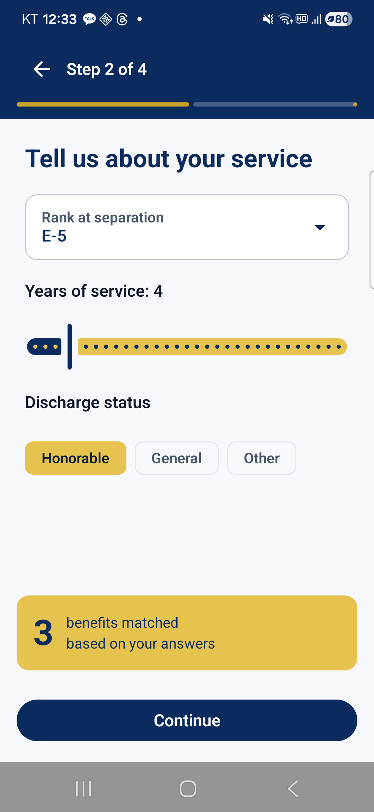

**무엇을 보여주는가**
- Rank: **E-5** 선택, Years of service / Service end date / Discharge status 모두 채워진 상태.
- 모든 필수 입력이 채워지면 `Continue` 버튼이 활성화되어 다음 단계로 진행 가능.

**의미**
- 입력값은 기기 내부 Room DB의 `VeteranProfile` 엔티티에 저장됩니다. 외부 서버로 전송되지 않습니다.

---

## 5. 온보딩 — Disability rating (3/4)

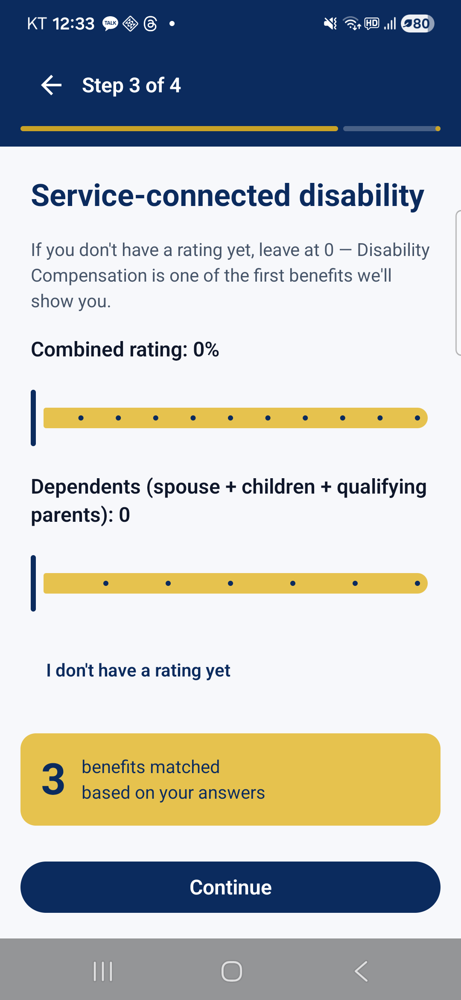

**무엇을 보여주는가**
- VA Disability Rating(군 복무 중 부상·질환에 대해 VA가 부여하는 장애 등급) 입력 단계.
- 슬라이더: **0% ~ 100%, 10% 단위**. 0%면 보상금 없음.
- 부양가족 수(Dependents) 드롭다운 — 30%↑ 등급일 때 보상금이 부양가족 수만큼 증액됩니다.

**기능 / 의미**
- 슬라이더 값이 바뀌면 하단의 *예상 매칭 혜택 개수*가 즉시 갱신됩니다 (예: rating 0% → GI Bill·Home Loan·Tricare 3개, 30%↑ → Disability Comp 추가).
- 정확한 등급을 모를 경우 0%로 두고 나중에 Settings에서 수정해도 됩니다.

---

## 6. 온보딩 — Location (4/4)

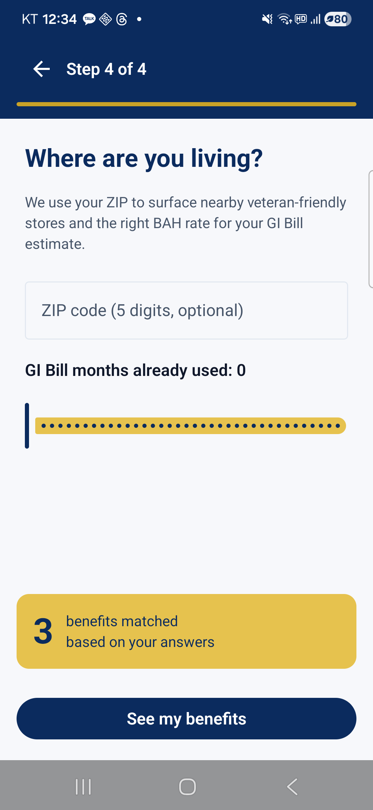

**무엇을 보여주는가**
- ZIP 코드(미국 우편번호 5자리) 입력 단계.
- 위치는 **할인 매장 지도**의 초기 중심점으로만 사용됩니다.

**기능 / 의미**
- 입력값은 ZIP 코드만 저장하며, 정확한 GPS는 추적하지 않습니다.
- 비워둔 채 진행 시 지도 화면에서 시스템 위치 권한 요청으로 대체됩니다.
- `Finish` 탭 → Home 화면으로 진입 + 온보딩 플래그가 `true`로 저장되어 다음 실행부터 Splash → Home 직행.

---

## 7. Home — 매칭 혜택 + 진행도

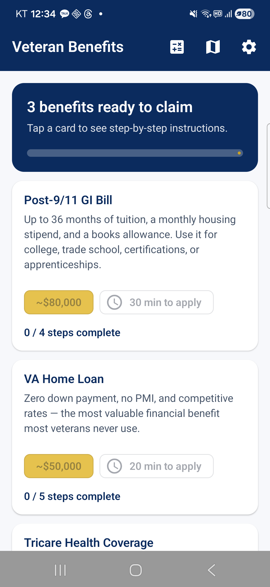

**무엇을 보여주는가**
- 상단 **ProgressHero**: `0 / 3 benefits claimed` — 현재 매칭된 혜택 중 사용자가 "신청 완료" 표시한 개수 / 전체.
- 매칭된 혜택 카드 3개 (E-5, 복무 4년, Honorable, rating 0% 기준):
  - **Post-9/11 GI Bill** — 학비 + 주거비 보조
  - **VA Home Loan** — 무이자·무다운페이 주택 융자 보증
  - **Tricare for veterans** — 전역 후 일정 기간 의료보험 연장

각 카드는:
- 혜택 타이틀 + 1줄 요약
- 예상 가치(Estimated value) 또는 카테고리 배지
- 카드 우측 미니 CTA — 탭하면 상세로 이동

**기능**
- 우상단 아이콘 3개:
  - **Map** — 할인 매장 지도
  - **Calculator** — 보상금/GI Bill 잔액 계산기
  - **Settings** — 프로필 및 정보
- 카드 탭 → 해당 혜택의 상세 화면

**의미**
- Home은 사용자의 *액션 허브*. 진행도 바를 보고 아직 받지 못한 혜택을 시각적으로 인지하도록 설계.
- rating을 30%↑로 올리면 *Disability Compensation* 카드가 추가되어 4개가 됩니다.

---

## 8. Benefit Detail — Post-9/11 GI Bill

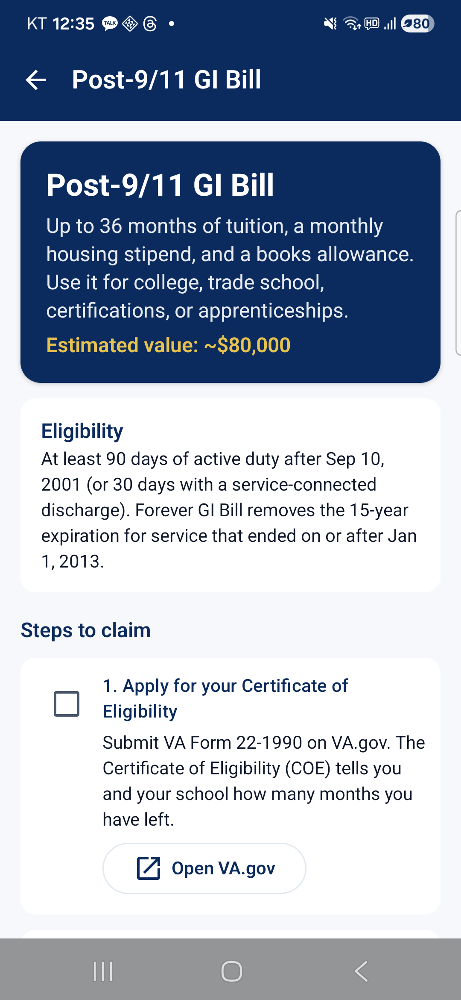

**무엇을 보여주는가**
- Hero: 혜택명 + 예상 가치(예: 학비 전액 + 월 거주비).
- **Eligibility (자격)** 섹션 — 충족해야 하는 조건 목록.
- **Steps (신청 단계)** — 체크 가능한 단계별 LazyColumn:
  - 단계 번호, 제목, 설명
  - 외부 링크가 있는 단계는 우측에 외부 아이콘
- 단계를 체크하면 Home의 진행도에 즉시 반영(완료 단계 비율).
- 하단 *VA.gov에서 신청 시작* CTA — Custom Tabs로 외부 페이지 오픈.

**기능 / 의미**
- 체크 상태는 Room DB(`BenefitChecklistItem`)에 영구 저장.
- 모든 단계 체크 → Home의 *claimed* 카운트 +1.
- 외부 링크는 In-App WebView가 아닌 **Chrome Custom Tabs**로 열려, VA.gov 인증 세션을 그대로 활용합니다.

---

## 9. Map — 할인 매장 지도 (한국 위치)

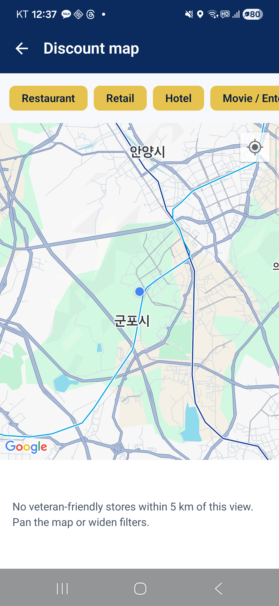

**무엇을 보여주는가**
- 상단 **카테고리 필터 칩**: Restaurant / Retail / Hotel / Movie / Auto / Other (가로 스크롤).
- Google Maps 본문 — 현재 위치 기준으로 카메라 이동.
- 하단 *"가까운 매장 목록"* — 현재 화면 5km 반경에 매장이 없으면 안내 메시지 표시.

**현재 화면(한국에서 실행) 의미**
- 시드 매장 100개는 모두 미국 5대 도시(NY/LA/Chicago/Houston/Atlanta)에 존재 → 한국 위치 기준으로는 표시할 매장이 없습니다.
- 따라서 *"No veteran-friendly stores within 5 km"* 안내가 출력됩니다.

**기능**
- 필터 칩 토글 → 해당 카테고리만 표시.
- 마커 탭 → 매장 *peek* 다이얼로그(이름/할인율/주소).
- 다이얼로그의 `View details` 탭 → 매장 상세 화면.

---

## 10. Map — "Search this area" 알약(Pill) 표시

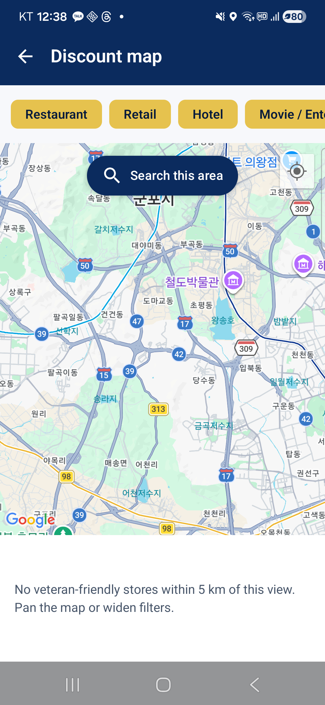

**무엇을 보여주는가**
- 사용자가 카메라를 1km 이상 이동시키고 손을 떼면 상단 중앙에 **검색 알약**이 슬라이드 인.
- *"Search this area"* — 현재 보고 있는 영역을 새로운 검색 중심으로 재설정합니다.

**기능 / 의미**
- 알약 탭 → 카메라 중심 좌표를 새 *user location*으로 저장 → 5km 반경 재계산.
- 카메라가 거의 정지(`isMoving == false`)이면서 마지막 검색 중심에서 1km 이상 떨어진 경우에만 노출.
- 미국 본토로 이동(NY 등)해서 알약을 누르면 즉시 마커들이 보이게 됩니다.

---

## 11. Calculator — Disability 탭

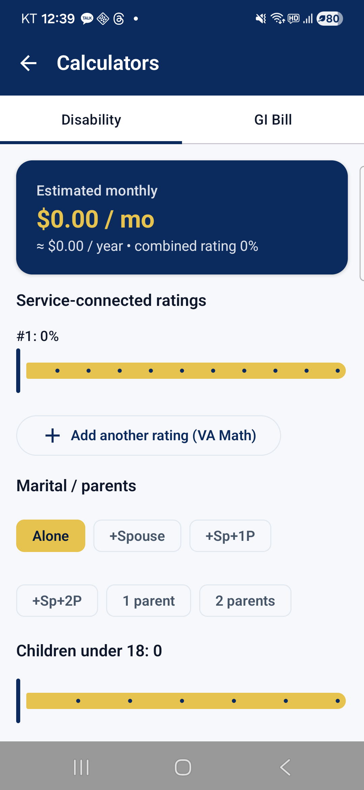

**무엇을 보여주는가**
- 두 개의 탭: **Disability** / **GI Bill**.
- Disability 입력:
  - **Combined rating** 슬라이더 (0~100%, 10단위)
  - **Dependents** 드롭다운 (배우자/자녀 수에 따라 보상금 증액)
- 결과:
  - **Monthly compensation** (USD)
  - **Annual** 환산 — `monthly × 12`
  - 적용된 등급 표시 + draft 데이터 disclaimer

**의미 / VA Math (38 CFR 4.25)**
- VA Disability는 단순 합산이 아닌 **효율 공식**으로 *combined rating*을 산출 후 10 단위로 반올림합니다.
- 예: 30% + 20% = 50%가 아니라 **44% → 반올림 40%**.
- 본 앱은 이 공식을 `CalculateDisabilityCompUseCase.combinedRating`에 구현하고, 단위 테스트 8개로 보호합니다.
- 표시되는 금액은 **2025 baseline에 1.025 COLA(생활비 조정)을 곱한 추정치**입니다.

---

## 12. Calculator — GI Bill 탭

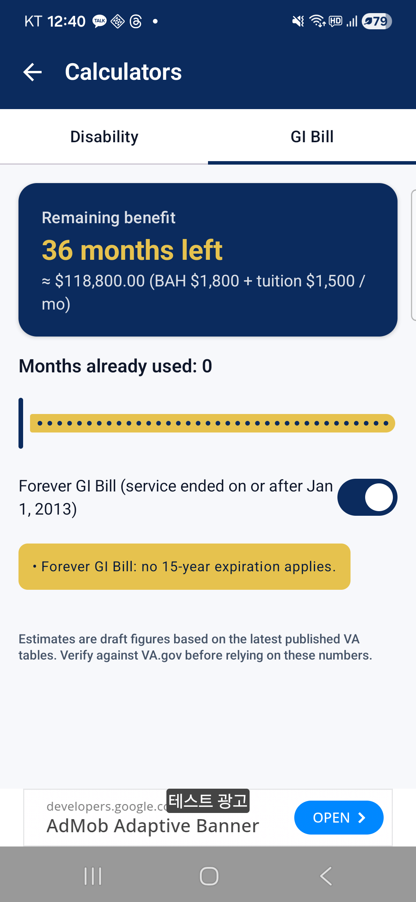

**무엇을 보여주는가**
- **Months used** 입력 — 이미 사용한 GI Bill 학자금 개월 수.
- **Service end date** 표시 — 온보딩에서 입력한 전역일.
- 결과:
  - **Months remaining** — `36 - used`
  - **Estimated value** — 잔여 개월 × $3,300/월 (학비 + 주거비 추정 단가)
  - **Expiration** — Forever GI Bill(전역일 ≥ 2013-01-01) 적용 시 *"No expiration"*, 그렇지 않으면 *"전역일로부터 15년"* 만료일 표기

**의미 / Forever GI Bill**
- 2017년 통과된 *Forever GI Bill* 법안으로, 2013년 1월 1일 이후 전역자는 학자금 만료(15년 delimiting date)가 사라졌습니다.
- 본 앱은 `LocalDate.of(2013, 1, 1)` 컷오프로 분기하여 만료일을 계산. 단위 테스트 5개로 검증.

---

## 13. Settings — 프로필 + 데이터 신선도 + 약관

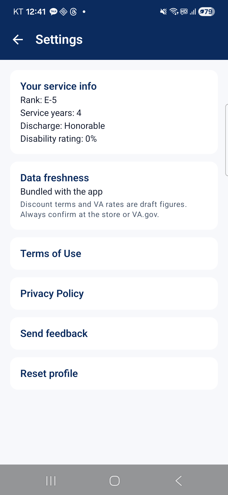

**무엇을 보여주는가**
- **Your service info** 카드: 온보딩에서 입력한 Rank / Service years / Discharge / Disability rating 요약.
- **Data freshness** 카드:
  - *Bundled with the app* — 현재 데이터는 앱에 번들된 시드를 사용 중.
  - 추후 GitHub Pages JSON에서 갱신되면 *"Last synced YYYY-MM-DD"* 형식으로 바뀝니다.
  - draft 경고 문구 항상 표시.
- 하위 메뉴 카드 4개:
  - **Terms of Use**
  - **Privacy Policy**
  - **Send feedback** — Google Form Custom Tabs로 오픈
  - **Reset profile** — 모든 입력값/체크리스트 삭제 후 온보딩으로 돌아감

**기능**
- 좌상단 ← 아이콘 → Home 복귀.
- 카드 탭 → 해당 화면 내비게이션.

---

## 14. Terms of Use — 이용약관

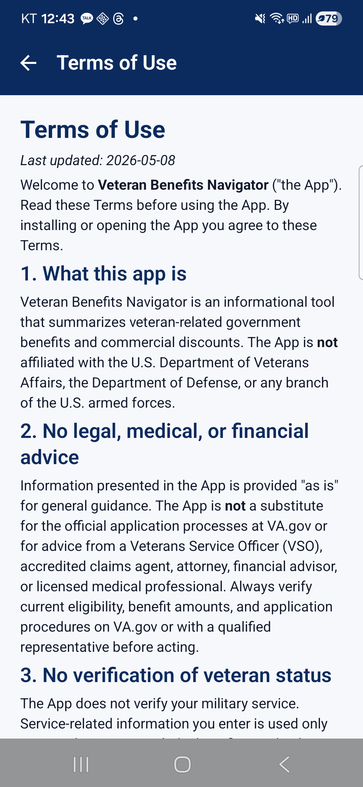

**무엇을 보여주는가**
- 영문 이용약관(Markdown 렌더링).
- 핵심 조항:
  1. **What this app is** — VA·DoD와 무관한 정보 제공용 도구. 미군의 공식 앱이 아님을 명시.
  2. **No legal, medical, or financial advice** — 본 앱 정보는 자격·금액의 공식 결정이 아니며, VA.gov 또는 인증 대리인의 확인이 필요.
  3. **No verification of veteran status** — 사용자가 입력한 군 복무 정보를 검증하지 않음.

**의미**
- 약관은 자산(`assets/legal/terms_en.md`)으로 번들되며, 영문 reviewer 검수가 출시 전 마지막 단계.
- 사용자는 앱 설치/실행으로 약관에 동의한 것으로 간주됩니다.

---

## 15. Privacy Policy — 개인정보 처리방침

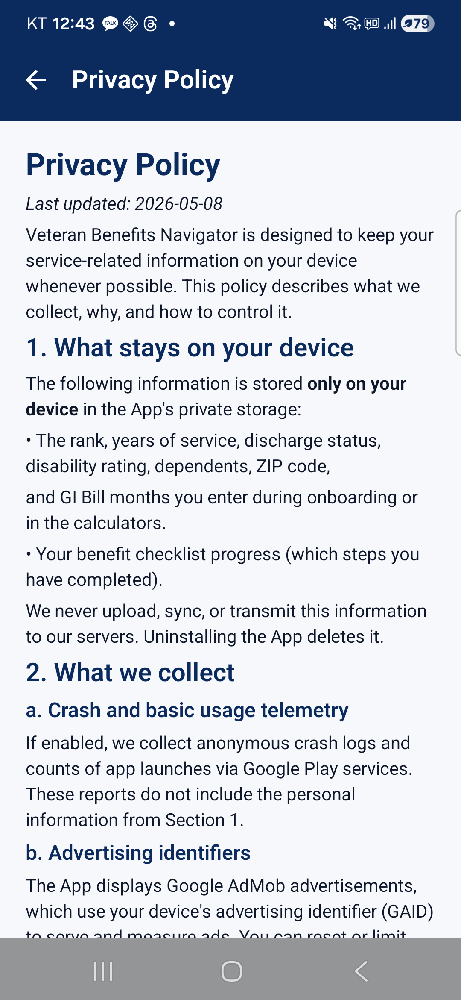

**무엇을 보여주는가**
- **What stays on your device (기기 내부에만 저장)**:
  - Rank, Years of service, Discharge status, Disability rating, Dependents, ZIP code, GI Bill 사용 개월
  - 혜택 체크리스트 진행 상황
  - 모두 **앱이 삭제되면 함께 삭제**, 서버 업로드 없음.
- **What we collect (수집 항목)**:
  - **Crash and basic usage telemetry** — Google Play services 통해 익명 충돌 로그 (Section 1의 개인정보 미포함).
  - **Advertising identifiers** — Google AdMob이 GAID(Google Advertising ID)를 사용해 광고 표시 및 측정.

**의미**
- 본 앱은 **PII(개인식별정보)를 절대 외부 서버로 전송하지 않습니다**. 프로필은 Room DB와 SharedPreferences에만 저장됩니다.
- AdMob 광고는 Google의 정책에 따라 제한·재설정 가능.

---

## 화면 흐름 요약

```
Splash (1.5s)
  └─ 첫 실행: Onboarding 1→2→3→4 → Home
      이후 실행: Home 직행
Home
  ├─ Benefit card 탭 → Benefit Detail (단계 체크 → Home 진행도 갱신)
  ├─ Map 아이콘 → Map → 마커 탭 → Store Detail (한국에서는 매장 없음)
  ├─ Calculator 아이콘 → Disability / GI Bill 탭 전환
  └─ Settings 아이콘 → Terms / Privacy / Send feedback / Reset profile
```

## 참고

- 자세한 아키텍처는 루트 `CLAUDE.md` 및 `README.md` 참고.
- 모든 추정 수치(VA Disability rate, GI Bill 가치, 매장 할인율)는 **draft**이며 실제 신청·결제 전 VA.gov 또는 매장 직접 확인 필수.
- 본 앱은 미군 신규 전역자(0~24개월)의 *최초 온보딩 가이드*로 설계되었으며, 공식 신청은 모두 VA.gov(Custom Tabs)에서 이루어집니다.
